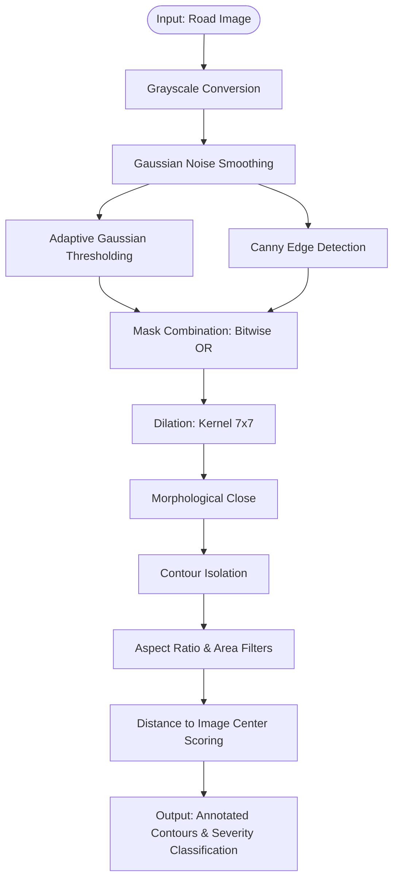

# PotholeAI — Smart Pothole Detection & Complaint Management System

PotholeAI is a full-stack, AI-powered road safety auditing platform that detects potholes from road images, classifies their hazard severity using an OpenCV pipeline, and automatically drafts municipal complaints via Google Gemini AI.

---

## 🚀 Key Features

* **Computer Vision Edge Isolation**: Interactive pipeline displaying Canny boundaries, Morphological closed binary masks, and segmentations.
* **OpenCV Scoring Engine**: Filters contour areas based on size and aspect ratios, prioritizing hazards closest to the driving lane center.
* **Gemini AI Complaint Drafter**: Compiles clinical, location-aware municipal repair requests based on detection metrics.
* **Post-Repair AI Verification**: Municipalities can upload repair photos; the OpenCV engine runs differential verification to verify repair completion.
* **Thread-Safe Data Ledger**: Light, thread-safe JSON ledger storing location reports, severity metrics, and progress notes.

---

## 🛠️ Tech Stack & Architecture

* **Frontend**: React, React Router, Tailwind CSS 3, Axios
* **Backend**: Python Flask 3, OpenCV (Headless), NumPy, Google GenerativeAI SDK
* **Database**: Local JSON storage with Thread-safe Locks

### Detection & Processing Pipeline



---

## 📂 Project Directory Structure

```text
pothole-app/
├── backend/
│   ├── app.py                  # Flask entry point & middleware config
│   ├── detector.py             # OpenCV contour processing pipeline
│   ├── gemini_client.py        # Gemini AI complaint generator
│   ├── storage.py              # Thread-safe JSON database operations
│   ├── requirements.txt        # Backend dependencies list
│   ├── .env.example            # Configuration boilerplate
│   └── routes/
│       ├── __init__.py
│       └── complaints.py       # REST API endpoints (creation, verification, stats)
├── frontend/
│   ├── package.json            # Node project configuration
│   ├── tailwind.config.js      # CSS spacing utility configurations
│   ├── public/                 # Page skeleton assets
│   └── src/
│       ├── App.jsx             # Core router and layout container
│       ├── index.js            # Build mount entry
│       ├── index.css           # Global typography & style configurations
│       ├── api.js              # Axios endpoint wrappers
│       ├── components/
│       │   └── UI.jsx          # Reusable tailwind components
│       └── pages/
│           ├── UploadPage.jsx  # Pothole reporting interface
│           ├── ResultPage.jsx  # Interactive CV pipeline display
│           ├── AdminPage.jsx   # Municipal complaints manager
│           └── VerifyPage.jsx  # Repair verification checklist
└── README.md
```

---

## ⚙️ Local Development Setup

Follow these steps to run the PotholeAI system locally:

### 1. Prerequisites
* Python 3.9+
* Node.js 18+
* Google Gemini API key → Get one from [Google AI Studio](https://aistudio.google.com/)

---

### 2. Backend Configuration
1. Open a terminal and navigate to the backend folder:
   ```bash
   cd backend
   ```
2. Create and activate a Python virtual environment:
   ```bash
   python -m venv venv
   # On macOS/Linux:
   source venv/bin/activate
   # On Windows:
   venv\Scripts\activate
   ```
3. Install dependencies:
   ```bash
   pip install -r requirements.txt
   ```
4. Configure environment:
   Copy `.env.example` to `.env` and fill in your Gemini API credentials:
   ```env
   GEMINI_API_KEY=AIzaSy...
   ```
5. Start the Flask server:
   ```bash
   python app.py
   ```
   The backend will start on `http://localhost:5000`.

---

### 3. Frontend Configuration
1. Open a new terminal and navigate to the frontend folder:
   ```bash
   cd frontend
   ```
2. Install dependencies:
   ```bash
   npm install
   ```
3. Launch the React server:
   ```bash
   npm start
   ```
   The application will launch at `http://localhost:3000`.

---

## 🔌 API Documentation

### `POST /complaints`
Upload a road image and location to run AI contour detection and complaint creation.
* **Payload (Multipart Form)**:
  * `image`: File (PNG, JPG, JPEG, WEBP)
  * `location`: String (Address or GPS coordinates)
* **Response (201 Created)**:
  * Returns detection confirmation, bounding box coordinates, and Gemini complaint draft text.

### `POST /complaints/{id}/verify`
Upload a post-repair verification image to confirm repair success.
* **Payload (Multipart Form)**:
  * `after_image`: File (Post-repair photo)
* **Response (200 OK)**:
  * Returns verification verdict (`verified` or `failed`) based on CV re-scan.

### `GET /complaints`
Retrieve a list of all complaints. Optional filter query parameters: `status` and `severity`.
